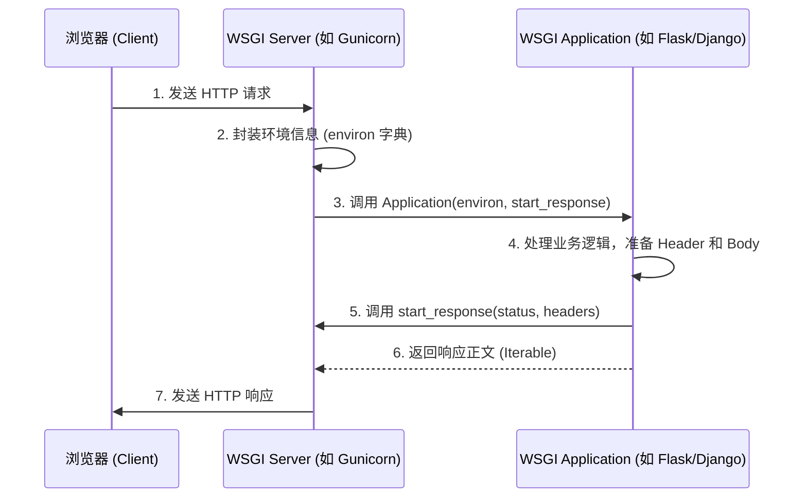

# Proj2 - Python WSGI Project

## WSGI (Web Server Gateway Interface) 流程解释

WSGI 是 Python Web 服务器与 Web 应用程序（或框架）之间的一种通用接口标准。它解决了不同 Web 服务器（如 Gunicorn, Nginx, Apache）与不同 Python 框架（如 Flask, Django）之间的兼容性问题。

### WSGI 的核心组成部分：
1. **Server/Gateway (服务器端)**: 负责接收来自浏览器的 HTTP 请求，将其解析为 Python 字典（environ），并调用应用程序。常用的有 Gunicorn, uWSGI。
2. **Application/Framework (应用程序端)**: 一个可调用的对象（通常是一个函数或类的实例），接收服务器传来的环境信息并返回响应内容。

### WSGI 流程图解：

### 流程详解：
1. **请求到达**：浏览器发送请求，WSGI Server 监听接口。
2. **环境封装**：Server 把请求信息（方法、路径、Cookie 等）放入 `environ` 字典，并提供一个 `start_response` 回调函数。
3. **应用处理**：Server 调用 App。App 根据 `environ` 路由到对应的逻辑，处理数据。
4. **状态反馈**：App 调用 `start_response` 告诉 Server HTTP 状态码（如 200 OK）和响应头。
5. **内容返回**：App 返回一个可迭代对象（如字符串列表），Server 将其组装成标准 HTTP 响应发回给浏览器。

---

## 运行本项目
目前本项目正在配置中。建议使用 Python 3.10 环境运行。
