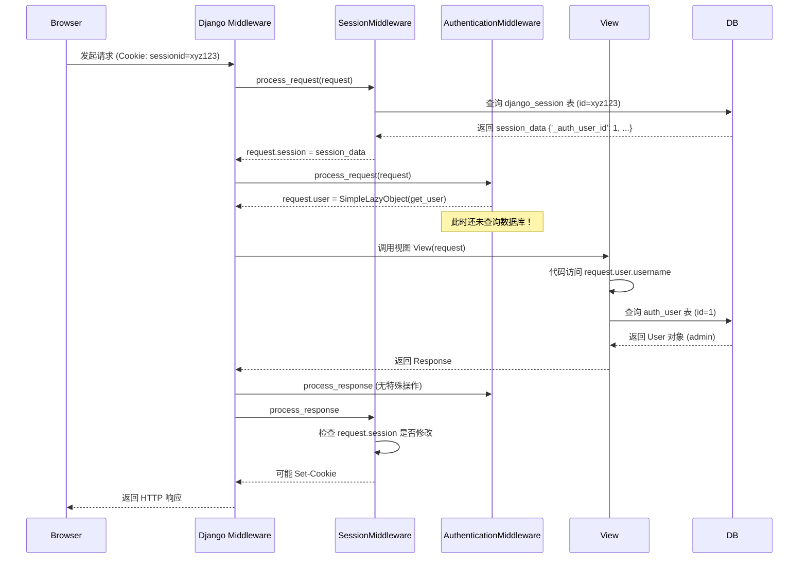

# Django Session 与 Authentication 中间件详解

这两个中间件是 Django 用户认证体系的基石，它们紧密配合，共同完成了 "识别当前请求是谁发出的" 这一任务。

## 1. 核心依赖关系

**必须的顺序**：
1.  `SessionMiddleware` (先执行)
2.  `AuthenticationMiddleware` (后执行)

**原因**：
用户登录状态本质上是存储在 Session 中的。`AuthenticationMiddleware` 需要从 `request.session` 中读取用户 ID 才能去数据库查找对应的用户对象。如果 Session 中间件没运行，`request` 对象上就没有 `session` 属性，认证中间件就会报错或失效。

---

## 2. SessionMiddleware 详解

**全名**: `django.contrib.sessions.middleware.SessionMiddleware`

### 主要职责
负责在 HTTP 请求之间保持状态。HTTP 是无状态协议，Session 通过在客户端（浏览器）设置 Cookie 和在服务端存储数据来维持“会话”。

### 工作流程 (Process Request)
1.  **解析 Cookie**: 从 `request.COOKIES` 中获取名为 `sessionid` (默认名) 的值。
2.  **加载数据**: 使用这个 ID 去 Session Backend (默认是数据库表 `django_session`) 查找对应的数据。
3.  **注入属性**: 将加载的数据（一个类字典对象）赋值给 `request.session`。
    *   即使没有 Cookie 或 Session 过期，也会创建一个空的 Session 对象，随时准备写入。

### 工作流程 (Process Response)
1.  **检查修改**: 检查 `request.session` 是否被修改过 (Modified) 或被访问过 (Accessed)。
2.  **保存数据**:
    *   如果数据变了，将 `request.session` 的内容序列化并保存回 Session Backend (如更新数据库)。
    *   如果 Session 是空的且没变过，通常不会创建记录。
3.  **设置 Cookie**: 如果创建了新的 Session (比如用户刚打开浏览器) 或 Session ID 变了，会在 HTTP 响应头中添加 `Set-Cookie`，将新的 `sessionid` 发回给浏览器。

---

## 3. AuthenticationMiddleware 详解

**全名**: `django.contrib.auth.middleware.AuthenticationMiddleware`

### 主要职责
基于 Session 中存储的信息，将当前请求关联到一个具体的 `User` 对象（或者是 `AnonymousUser`）。

### 工作流程 (Process Request)
1.  **检查 Session**: 确认 `request` 对象上是否有 `session` 属性 (由 SessionMiddleware 提供)。
2.  **获取 User ID**: 从 `request.session` 中查找特定的 Key (默认为 `_auth_user_id`)，这是用户登录时写入的。
3.  **获取 User 对象 (Lazy Loading)**:
    *   它**不会**立即去数据库查询用户信息。
    *   它会将 `request.user` 设置为一个 **`SimpleLazyObject`**。
    *   **只有当你代码里真正访问 `request.user` 属性时** (例如 `request.user.username` 或 `if request.user.is_authenticated`)，它才会真正执行 SQL 查询去 `auth_user` 表里读取用户信息。
    *   如果在整个请求处理过程中没用到 `request.user`，就不会产生这条数据库查询，以此优化性能。

### 如果没有登录
*   如果在 Session 里找不到用户 ID，或者用户不存在，`request.user` 会被赋值为一个 **`AnonymousUser`** 实例。
*   `AnonymousUser` 用于表示未登录访客，它的 `is_authenticated` 属性永远为 `False`。

---

## 4. 交互示例图解

