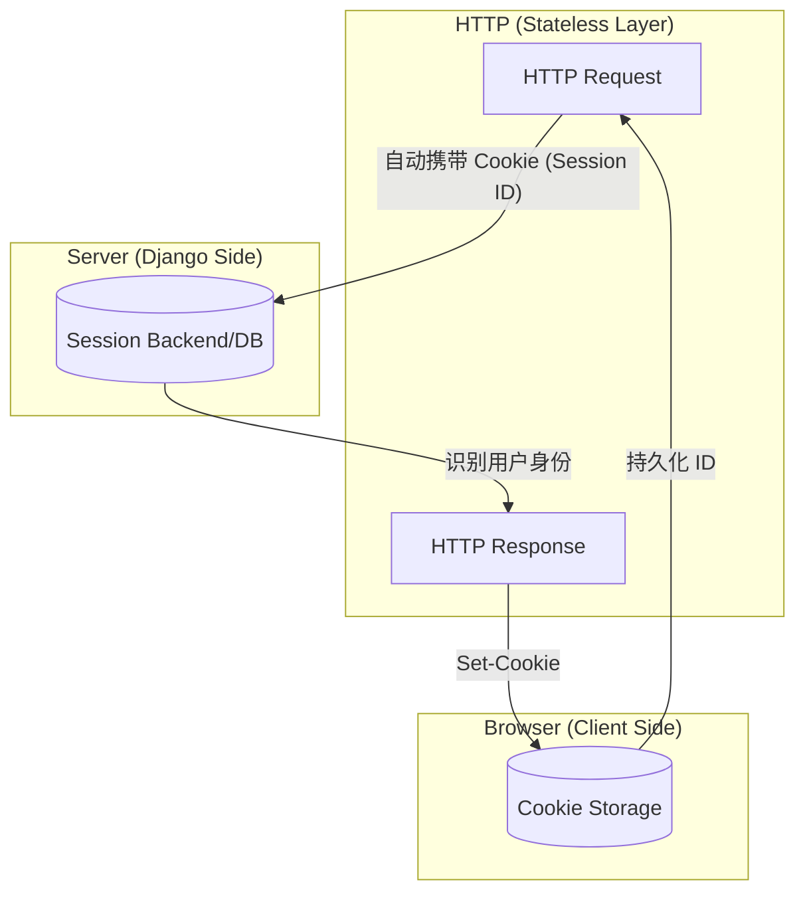

# HTTP 协议、Cookie 与 Session 详解

在 Web 开发中，理解 HTTP 的无状态性（Stateless）以及如何通过 Cookie 和 Session 维持状态是至关重要的。

---

## 1. HTTP 协议：无状态的基石

HTTP（超文本传输协议）是应用层协议，它最显著的特点是**无状态**。

### 什么是“无状态”？
*   **定义**：服务器不会保存关于客户的任何上下文信息。每个请求都是独立的，服务器处理完请求并发送响应后，就会“忘记”这个请求。
*   **比喻**：就像在一个没有会员系统的快餐店点餐，你每次去，店员都不认识你，你必须重新告诉他你想吃什么。
*   **优点**：协议简单，服务器处理压力小，易于扩展（负载均衡时请求可以去任何一台服务器）。
*   **缺点**：无法直接实现“登录”、“购物车”等需要跨请求记忆的功能。

为了解决这个问题，引入了 Cookie 和 Session 机制。

---

## 2. Cookie：客户端的状态存储

Cookie 是服务器发送到用户浏览器并保存在本地的一小块数据。

### 工作原理
1.  **服务器设置**：服务器在响应头中加入 `Set-Cookie` 指令。
    ```http
    HTTP/1.1 200 OK
    Set-Cookie: user_id=123; Path=/; HttpOnly
    ```
2.  **浏览器存储**：浏览器接收到响应后，将 Cookie 存储在本地。
3.  **自动携带**：之后浏览器向该服务器发送请求时，会**自动**在请求头中携带这些 Cookie。
    ```http
    GET /profile HTTP/1.1
    Cookie: user_id=123
    ```

### 安全属性
*   **HttpOnly**：防止 JavaScript 通过 `document.cookie` 访问，有效防范 XSS 攻击。
*   **Secure**：强制 Cookie 仅通过 HTTPS 协议传输。
*   **SameSite**：防止 CSRF 攻击，限制跨站请求携带 Cookie。

---

## 3. Session：服务端的会话管理

Session 是存储在服务器上的一组数据，用于记录用户的状态。

### 为什么需要 Session？
Cookie 虽然能存数据，但有明显的缺点：
*   **大小限制**：单个 Cookie 通常不能超过 4KB。
*   **安全风险**：数据存在客户端，用户可以随意查看和修改。

### 工作原理（跨请求的一根线）
Session 本质上是利用 Cookie 来传递一个“通行证 ID”：
1.  **创建**：用户登录成功，服务器在服务端生成一个唯一的 `Session ID`（如 `xyz789`）。
2.  **存储**：服务器将用户信息（用户 ID、购物车内容等）存入数据库或 Redis 中，以 `xyz789` 为键。
3.  **分发 ID**：服务器通过 Cookie 将这个 ID 发给浏览器：`Set-Cookie: sessionid=xyz789`。
4.  **识别**：下次浏览器请求时，带着 `sessionid=xyz789`。服务器根据这个 ID 去自己的仓库里查找，就能知道：“哦，这是用户张三”。

---

## 4. Web Storage (LocalStorage & SessionStorage)

除了 Cookie，HTML5 还引入了更现代的客户端存储方案：**Web Storage**。它包含 `localStorage` 和 `sessionStorage`。

### LocalStorage (本地存储)
*   **生命周期**：持久化存储。除非手动删除或清空浏览器缓存，否则数据**永不过期**。
*   **作用域**：同源协议、域名、端口下共享。
*   **用途**：保存一些非敏感的偏好设置（如深色模式主题、草稿箱等）。

### SessionStorage (会话存储)
*   **生命周期**：仅在当前**窗口或标签页**运行期间有效。关闭标签页或窗口后数据即被清除。
*   **作用域**：同一标签页且同源。
*   **用途**：单页应用中临时的状态维护。

### 与 Cookie 的区别
1.  **不随请求发送**：Web Storage 数据完全留在浏览器端，不会像 Cookie 那样每次请求都发给服务器，节省了流量和带宽。
2.  **容量限制**：比 Cookie 大得多（通常为 5MB - 10MB）。
3.  **API 友好**：通过 `localStorage.setItem('key', 'value')` 即可操作，比拼凑 Cookie 字符串方便得多。

---

## 5. 三者关系总结图



## 6. 区别对比

| 特性 | Cookie | Session (Server) | LocalStorage |
| :--- | :--- | :--- | :--- |
| **存储位置** | 客户端（浏览器） | 服务端（数据库/Redis/内存） | 客户端（浏览器） |
| **生命周期** | 可设置过期时间，否则随浏览器关闭 | 随 Session 过期或销毁 | 永久存储，除非手动清理 |
| **大小限制** | 约 4KB | 理论上无限制 | 约 5MB - 10MB |
| **网络传输** | **每次 HTTP 请求都会携带** | 不参与传输（仅 ID 传输） | **从不参与传输** |
| **安全性** | 较低（可通过 HttpOnly 增强） | 很高 | 较低（容易受到 XSS 攻 击） |
| **数据共享** | 同源窗口共享 | 随 Session ID 共享 | 同源窗口共享 |

## 7. 在 Django 中的体现

*   **HTTP**: Django 的 `HttpRequest` 和 `HttpResponse` 对象是对协议的深度封装。
*   **Cookie**: 你可以通过 `response.set_cookie()` 手动设置，或在中间件中读取。
*   **Session**: Django 的 `SessionMiddleware` 自动处理了 Session ID 的生成、Cookie 设置以及从数据库加载数据的全过程，让你在代码中只需通过 `request.session` 即可操作状态。
